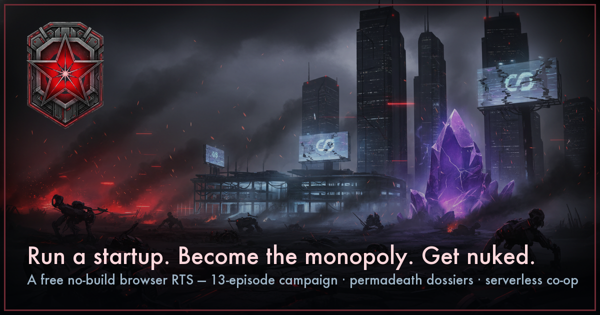

# STARLEFT



**A no-build browser RTS where you run a startup, crush rival megacorps, become the monopoly — then everyone nukes each other. And that's only Act One.**

### ▶ [PLAY NOW → starleft.vercel.app](https://starleft.vercel.app)

Free. In your browser. Nothing to install.

---

## What it is

- 🪦 **Procedural dossiers + a permadeath memorial.** Every fighter has a name, a hometown, a family, a trauma, and a dream they're chasing. When they die, they go on the wall — dream fulfilled or not — and the campaign's entire second act is about whether death has to be final. Spoiler: A&O already turned resurrection into a billing model.
- 📉 **A 13-episode moral-descent campaign + gated side-ops and boss duels.** You start as the scrappy underdog and win by becoming everything you fought: the unicorn, the monopoly, the board. Then the flash takes it all, and the resurrection arc begins. Skirmish, daily seeded maps, mutators, and New Game+ when the campaign's done.
- 🤝 **Serverless 2-player co-op (and 1v1 duels).** Pure WebRTC peer-to-peer — share a room code or a QR, no accounts, no servers. Plus solo skirmishes with stackable mutators and a shared "Daily Disruption" map everyone plays on the same seed.

## The no-build angle

The whole game is plain HTML + CSS + classic JavaScript sharing one global scope. No bundler, no package manager, no framework, no transpiler. `python3 -m http.server` is the entire dev environment:

```bash
git clone <this repo>
cd starleft
python3 -m http.server 8000   # then open http://localhost:8000/rts.html
```

(Serving over http(s) matters for co-op — `file://` disables WebRTC. Everything else works straight off the filesystem.)

## Controls (the short version)

Tap/click to select and command. Right-click (or tap) an enemy to attack, a crystal to mine, the ground to move. `A` + click = attack-move. `F2` selects your whole army. Shift-drag boxes a squad; `Ctrl/⌘ + 1–9` binds control groups. The full Field Manual lives in the game's menu.

## License & assets

All art, audio, and code in this repository are original or generated in-house (see `_dev/gen/` for the asset pipelines — sprite generation, local TTS narration, synthesized SFX).
