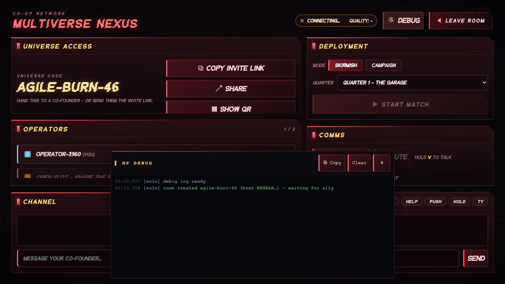
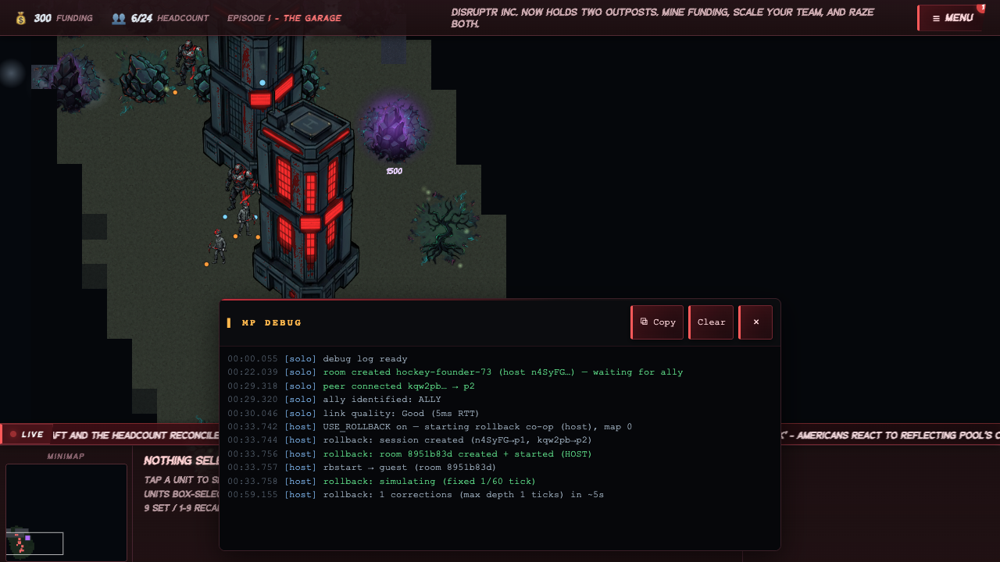
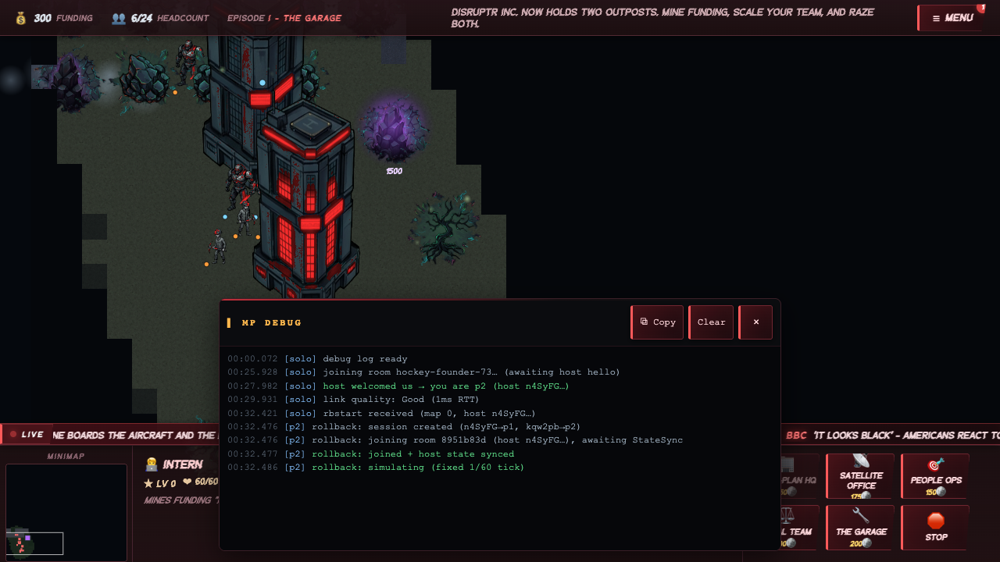

# STARLEFT Multiplayer — Playwright-CLI Test Report

_Generated by `docs/mp/playwright/run-mp-test.sh` on 2026-06-04 23:36 UTC._

**Result: PASS** — 38 passed, 0 failed, 0 skipped.

| Status | Tier | Assertion |
|---|---|---|
| ✓ PASS | T1 | determinismTest returns true |
| ✓ PASS | T1 | determinismSweep returns true |
| ✓ PASS | T1 | rbRoundTripTest returns true |
| ✓ PASS | T1 | rbLocalTest -> [rb] LOCAL PASS |
| ✓ PASS | T1 | rbLocalCmdTest -> [rb] CMD PASS (input model + rollback) |
| ✓ PASS | T1 | no FAIL/DESYNC in captured console |
| ✓ PASS | T2 | MP lobby (#mpScreen) opens |
| ✓ PASS | T2 | room screen (#mpRoomScreen) shows |
| ✓ PASS | T2 | room code: DOM == MP_SESSION.code |
| ✓ PASS | T2 | room code matches A-B-NN pattern |
| ✓ PASS | T2 | debug panel opens (flex) |
| ✓ PASS | T2 | toggle chip highlights (.on) |
| ✓ PASS | T2 | an OK-level 'room created' row |
| ✓ PASS | T2 | DOM has a .mp-dbg-row.mp-dbg-ok |
| ✓ PASS | T2 | row text is 'mm:ss.mmm [role] …' |
| ✓ PASS | T2 | lobby-debug.png captured |
| ✓ PASS | T2 | Copy source text well-formed |
| ✓ PASS | T2 | Clear empties the DOM list |
| ✓ PASS | T2 | Clear empties the buffer |
| ✓ PASS | T2 | Close hides the panel |
| ✓ PASS | T3 | USE_ROLLBACK set on host |
| ✓ PASS | T3 | USE_ROLLBACK set on client |
| ✓ PASS | T3 | host/client are distinct peers |
| ✓ PASS | T3 | host room created (hockey-founder-73) |
| ✓ PASS | T3 | WebRTC handshake (host<->client) connected |
| ✓ PASS | T3 | host: rollback session created |
| ✓ PASS | T3 | host: rbstart sent to guest |
| ✓ PASS | T3 | client: rbstart received |
| ✓ PASS | T3 | client: host state synced |
| ✓ PASS | T3 | both: simulating (1/60 tick) |
| ✓ PASS | T3 | host in-game (running, role host) |
| ✓ PASS | T3 | client in-game (running, role client) |
| ✓ PASS | T3 | no DESYNC on host |
| ✓ PASS | T3 | no DESYNC on client |
| ✓ PASS | T3 | live command: peer states converge ({\"u\":\"331,1903/idle\",\"p2\":6}) |
| ✓ PASS | T3 | no DESYNC after command (host) |
| ✓ PASS | T3 | in-game debug screenshots captured |
| ✓ PASS | T3 | disconnect surfaced in client log |

## Tier 1 — in-process harness console output
```
[det] PASS — 900 ticks identical on map 0 (seed 12345). Intra-engine determinism holds; RNG was the only divergence source. Final hash 0x77360a74. Next: Stage 1 cross-browser shadow (see docs/mp/netcode-decision.md).
[det] PASS — 900 ticks identical on map 0 (seed 1). Intra-engine determinism holds; RNG was the only divergence source. Final hash 0x77360a74. Next: Stage 1 cross-browser shadow (see docs/mp/netcode-decision.md).
[det] PASS — 900 ticks identical on map 0 (seed 12345). Intra-engine determinism holds; RNG was the only divergence source. Final hash 0x77360a74. Next: Stage 1 cross-browser shadow (see docs/mp/netcode-decision.md).
[det] PASS — 900 ticks identical on map 0 (seed 999999). Intra-engine determinism holds; RNG was the only divergence source. Final hash 0x77360a74. Next: Stage 1 cross-browser shadow (see docs/mp/netcode-decision.md).
[det] PASS — 900 ticks identical on map 1 (seed 1). Intra-engine determinism holds; RNG was the only divergence source. Final hash 0x4b11c5cd. Next: Stage 1 cross-browser shadow (see docs/mp/netcode-decision.md).
[det] PASS — 900 ticks identical on map 1 (seed 12345). Intra-engine determinism holds; RNG was the only divergence source. Final hash 0x4b11c5cd. Next: Stage 1 cross-browser shadow (see docs/mp/netcode-decision.md).
[det] PASS — 900 ticks identical on map 1 (seed 999999). Intra-engine determinism holds; RNG was the only divergence source. Final hash 0x4b11c5cd. Next: Stage 1 cross-browser shadow (see docs/mp/netcode-decision.md).
[det] PASS — 900 ticks identical on map 2 (seed 1). Intra-engine determinism holds; RNG was the only divergence source. Final hash 0x6f3a0754. Next: Stage 1 cross-browser shadow (see docs/mp/netcode-decision.md).
[det] PASS — 900 ticks identical on map 2 (seed 12345). Intra-engine determinism holds; RNG was the only divergence source. Final hash 0x6f3a0754. Next: Stage 1 cross-browser shadow (see docs/mp/netcode-decision.md).
[det] PASS — 900 ticks identical on map 2 (seed 999999). Intra-engine determinism holds; RNG was the only divergence source. Final hash 0x6f3a0754. Next: Stage 1 cross-browser shadow (see docs/mp/netcode-decision.md).
[det] SWEEP PASS
[rb] ROUND-TRIP PASS — save→advance→restore→re-advance bit-identical over 600 ticks (map 0, seed 12345). The Game serializes completely for rollback.
[rb] localtest: sessions created; creating room…
[rb] localtest: room b1e0cc79 created + started; guest joining…
[rb] localtest: joined; running 600 lockstep ticks…
[rb] LOCAL PASS — 2 Sessions hash-identical over 600 ticks (map 0, seed 12345). Session + transport + StateSync + step all work.
[rb] cmdtest: creating room…
[rb] cmdtest: joined; running 600 ticks with a MOVE at tick 120…
[rb] cmdtest: host MOVE unit 7 → (584,1936)
[rb] CMD PASS — host command replicated + reconciled; final states identical (0xa24da75d), rollbacks=1, no desync. The input model works.
```

## Tier 3 — host debug log
```
00:00.055 [solo] debug log ready
00:22.039 [solo] room created hockey-founder-73 (host n4SyFG…) — waiting for ally
00:29.318 [solo] peer connected kqw2pb… → p2
00:29.320 [solo] ally identified: ALLY
00:30.046 [solo] link quality: Good (5ms RTT)
00:33.742 [host] USE_ROLLBACK on — starting rollback co-op (host), map 0
00:33.744 [host] rollback: session created (n4SyFG→p1, kqw2pb→p2)
00:33.756 [host] rollback: room 8951b83d created + started (HOST)
00:33.757 [host] rbstart → guest (room 8951b83d)
00:33.758 [host] rollback: simulating (fixed 1/60 tick)
00:59.155 [host] rollback: 1 corrections (max depth 1 ticks) in ~5s
```

## Tier 3 — client debug log (incl. induced disconnect)
```
00:00.072 [solo] debug log ready
00:25.928 [solo] joining room hockey-founder-73… (awaiting host hello)
00:27.982 [solo] host welcomed us → you are p2 (host n4SyFG…)
00:29.931 [solo] link quality: Good (1ms RTT)
00:32.421 [solo] rbstart received (map 0, host n4SyFG…)
00:32.476 [p2] rollback: session created (n4SyFG→p1, kqw2pb→p2)
00:32.476 [p2] rollback: joining room 8951b83d (host n4SyFG…), awaiting StateSync
00:32.477 [p2] rollback: joined + host state synced
00:32.486 [p2] rollback: simulating (fixed 1/60 tick)
01:25.306 [p2] WARN host link dropped (left) — reconnecting…
01:25.308 [p2] WARN reconnect attempt 1/4…
01:25.310 [p2] WARN rollback transport: peer n4SyFG… disconnected
01:25.310 [p2] WARN rollback: player left n4SyFGxnFfZE0BrGqXfJ
```

## Screenshots
- Lobby + debug panel: 
- Rollback host in-game: 
- Rollback client in-game: 
