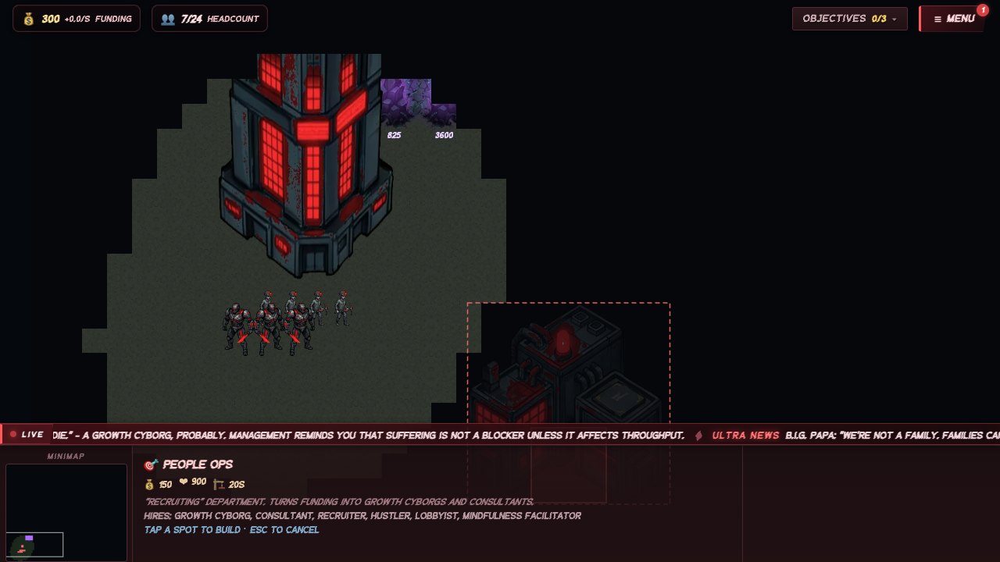
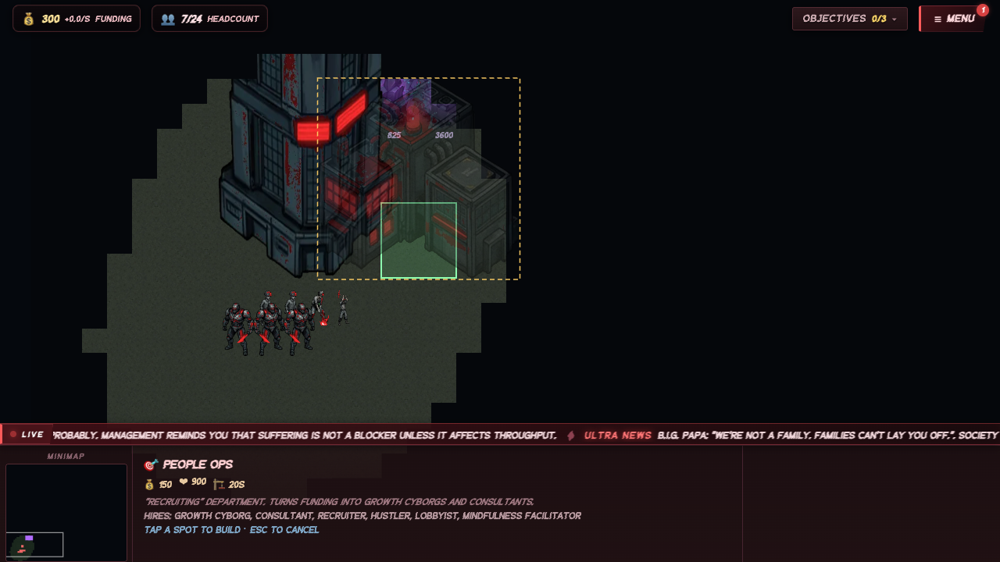
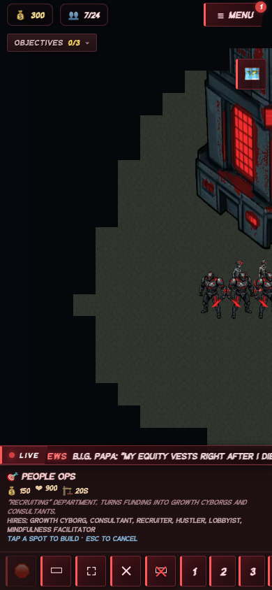

# STARLEFT Building Placement — Playwright-CLI Test Report

_Generated by `docs/placement/run-placement-test.sh` on 2026-06-22 02:32 UTC._

**Result: PASS** — 23 passed, 0 failed.

| Status | Assertion |
|---|---|
| ✓ PASS | A1 valid open tile is buildable |
| ✓ PASS | A2 out-of-bounds rejected (all four edges) |
| ✓ PASS | A3 blocked tile rejected |
| ✓ PASS | A4 topography feature rejected |
| ✓ PASS | A5 unexplored (fog) rejected |
| ✓ PASS | A6 overlap existing building rejected |
| ✓ PASS | A7 overlap goldmine rejected |
| ✓ PASS | A8 adjacent (no overlap) is buildable |
| ✓ PASS | B1 two HQs base-to-base: allowed but flagged |
| ✓ PASS | B2 HQ with a clear gap: allowed and NOT flagged |
| ✓ PASS | B3 intel adjacency NOT over-restricted (art < footprint) |
| ✓ PASS | B4 turret adjacency IS flagged (art > footprint) |
| ✓ PASS | C1 hq art box larger than footprint |
| ✓ PASS | C2 barracks art box wider than footprint |
| ✓ PASS | C3 turret overhang is the special 1.18 (wider than 1.08) |
| ✓ PASS | C4 intel art WIDTH smaller than footprint (0.25 scale) |
| ✓ PASS | C5 darktower art box wider than footprint |
| ✓ PASS | C6 every art box is bottom-anchored & horizontally centred |
| ✓ PASS | D1 buildingDrawBox ≡ buildingArtBoxTiles (shared geometry) |
| ✓ PASS | E1 no same-tier start buildings pile (all maps) |
| ✓ PASS | E2 every start building sits on valid ground (all maps) |
| ✓ PASS | E3 player can reach an enemy base (all maps with enemies) |
| ✓ PASS | F1 newMap produces identical start layout twice (all maps) |

## Preview screenshots
- Desktop, open ground (green ghost): 
- Crowding the HQ (amber warning, still placeable): 
- Narrow / 390px viewport: 
